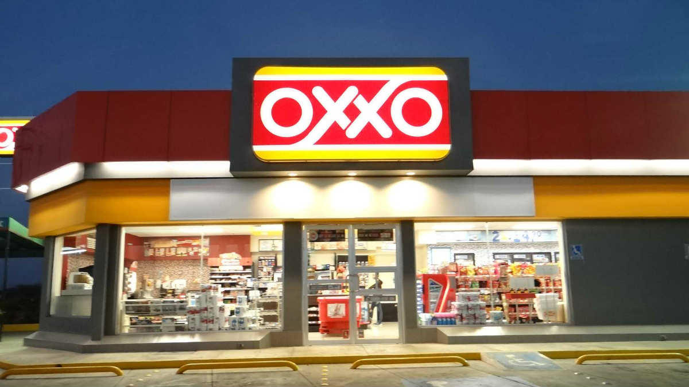

# Tema: Análisis de mercado de Ropa para Tallas Extra (Parte 3)

  
 ### Introducción:
 
 ### ¡Mejorando nuestro análisis de nuestros datos con Python!

Desde módulos anteriores ([**`la primera etapa del proyecto`**](https://github.com/Deltarios/analisis-ropa-bedu) y [**`la segunda etapa del proyecto`**](https://github.com/Deltarios/analisis_ropa_bedu_2)) se tomo como tema a desarrollar el análisis del mercado de venta de Ropa de talla extra, esto por la creciente demanda de este sector en nuestro país y fuera de el, se tomaron aspectos geográficos estableciendo la óptima ubicación de puntos de venta, el poder adquisitivo por estado, los índices de obesidad los cuales muestran alto aumento del porcentaje de obesidad  en una tendencia lineal, afluencia de personas por sector así como la  optimización de una marca específica que aborde la creciente necesidad vinculada a este rubro. [**`Ver Video Explicativo aquí`**](video)

---
### Integrantes: 

- Axel Flores Guarneros.
- Marco Antonio Armas Santillán.
- Ariel Arturo Ríos Sierra.  
- Evelyn Jocelyn Gonzalez Acevedo

---
### Contenido del Repositorio:

> NOTA: El archivo **`Ropas_Extra_Parte_3.ipynb`** pueden tardar en cargar en github, reintentar abrir si marca error de lo contrario abrilos en [**`Colab by Google`**](https://colab.research.google.com/)

-  [**`Ropas_Extra_Parte_3.ipynb`**](proyecto/Ropas_Extra_Parte_3.ipynb)
   El archivo contiene el análisis de las variables escogidas para la localización de la tienda de ropas extras así como las ubicaciones idelaes para implementar centros de almacenaje del producto para las ventas por el mercado en línea [**`Ver en Colab Aquí`**](https://colab.research.google.com/github/Deltarios/analisis_ropa_bedu_3/blob/master/proyecto/Ropas_Extra_Parte_3.ipynb)

-  [**`Datasets`**](datasets)
   Grupo de datasets utilizados en el proyecto (Otros pueden ser rutas directa a los repositorios contenedores).
   
---
### Desarrollo: 

> NOTA: Esto es en modo de resúmen, dentro del Script [**`Ropas_Extra_Parte_3.ipynb`**](projecto/Ropas_Extra_Parte_3.ipynb) se encuentra explicado cada detalle de la obtención de la información.

En este módulo tomaremos el análisis realizado del top 5 de estados, realizada en [**`la primera etapa del proyecto`**](https://github.com/Deltarios/analisis-ropa-bedu) y retomaremos el estado de Nuevo León para nuestro análisis. 

Calculamos la media, mediana y desviación estándar de las 4 variables  

•	Porcentaje de obesidad por Municipio

•	Número de ventas en millones de pesos por Municipio

•	Concentración de tiendas por Municipio

•	Concentración de tiendas por colonias

Variables que servirán para elegir las mejores tiendas de acuerdo a estas características

En cada uno de ellos tenemos una tabla de valores atípicos su distribución varia desde 20, 14, 12, 10 respectivamente los valores de la tabla son los conteos de cada agrupación. De esta manera quedan aún en más evidencia los valores atípicos, ya que podemos ver varios segmentos donde la cantidad de muestras es muy baja.

#### CANTIDAD DE PERSONAL VS TIPO DE VIALIDAD

Podemos observar que la mayoría de las tiendas se encuentran en un tipo de vialidad de "calle" y "avenida" en donde el estrato más común es de 0 a 5 personas, seguido de 6 a 10 personas. Por lo que podemos observar que la gran mayoría de tiendas tiene un número de personal no muy alto.

#### CANTIDAD DE PERSONAL VS SECTOR DE TIENDA

Podemos observar nuevamente que la cantidad de personal más común es la de 0 a 5 personas, mientras que los sectores de tienda más comunes son:

•	Comercio al por menor de ropa, excepto de bebé y lencería, ocupando el 64.86% del mercado

•	Comercio al por menor de artículos usados, ocupando el 6.96% del mercado

•	Comercio al por menor de ropa de cuero y piel y de otros artículos de estos materiales, ocupando el 4.95% del mercado

#### DIMESIÓN DE TIENDA VS RATING

Podemos observar nuevamente que cuando podemos identificar el tamaño de la tienda, las C (Pequeña) tienen el rating más alto, lo mismo pasa con las dimensiones de tienda sin especificar, en donde se tiene la calificación más alta.
Seguramente esto sucede debido a que las tiendas más grandes tienen mayor número de calificaciones por lo que este rating se promedia, siendo el más común de las tiendas de tamaño grande (A) el valor de 4.3.

#### MUNICIPIO VS CANTIDAD DE PERSONAL VS DIMENSION DE TIENDA

Al realizar un análisis involucrando a estas variables se puede mostrar, por ejemplo, que en el municipio de Allende es más común encontrar tiendas de dimensión sin especificar y con una cantidad de empleados de 0 a 5 personas, siendo la primera observación común en los 4 municipios.

#### Ubicación de almacenes para distribución basado en análisis de distribución

Oxxo se ha convertido en el retailer de alimentos y bebidas más exitoso de México. Desde la apertura de su primera tienda, en 1978, ha tenido un crecimiento vertiginoso que le llevó a ser la cadena de tiendas de conveniencia más grande del país, Su despliegue territorial ha sido tal que tiene siete veces más tiendas que su competidor más cercano, 7Eleven, que opera mil 699 unidades en México.

Dicha empresa se encarga de identificar las ubicaciones ideales y así definir su estrategia de expansión, según la densidad poblacional de cada zona, además toma en cuenta su logística, la cual tiene como objetivo el brindar a los proveedores con capacidad logística limitada la posibilidad de entregar el producto en sus centros de distribución, llevando los productos en un menor tiempo a sus tiendas. [**`Ver fuente`**](https://www.elfinanciero.com.mx/empresas/seis-factores-clave-que-explican-el-exito-de-oxxo/)

Este último punto es fundamental para nuestro análisis ya que en módulos anteriores se realizo un estudio donde se encontró la ubicación geográfica óptima para la ubicación de la tienda
Ubicar de forma correcta las instalaciones de venta e instalaciones a lo largo de una cadena de suministro es una decisión importante que da forma, estructura y conformidad al sistema logístico. En este punto  se busca hacer una comparativa de las ubicaciones de una fábrica/almacen y de un punto de venta. Alguno de los punto a considerar son:

•	Potencial de ingresos de un lugar determinado. 

•	Evita la necesidad de considerar las fuerzas competitivas, la ruptura de la demanda entre diferentes instalaciones

•	El coste de transporte es el principal punto que debemos considerar para realizar envios. 

Dependiendo del caso, las instalaciones pueden representar una gran inversión en activos fijos, dificilmente revertidos a corto y medio plazo, lo que por su vez implica un alto coste para la ubicación de la instalación en otro sitio.
